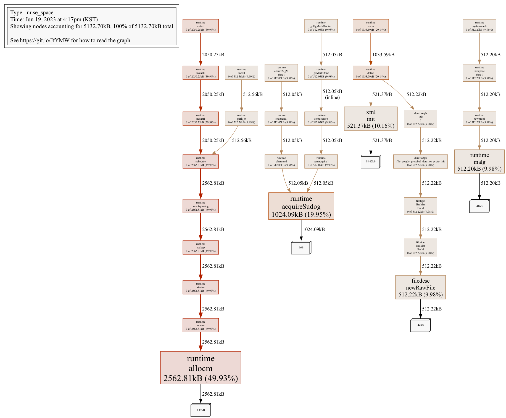

# Go 언어를 이용한 Fatima 프로세스 개발

## 목차

---

## 1. 개요

`Fatima`는 Go 언어로 작성된 프로세스 개발, 실행 관리 프레임워크입니다.

자세한 소개는 `링크` 를 참고하시면 되고 해당 문서에서는 Fatima Framework 를 통해 Go 언어를 이용해서 프로세스를 개발하는 방법을 살패보겠습니다. 

---

## 2. 사전 준비

이후 과정을 진행하려면 개발하고자 하는 PC에 Fatima 관련 툴이 설치되어 있어야 합니다. 

자세한 설치 내용은 `링크`를 참고하세요.

---

## 3. Go 개발 환경 설정

1. [Go 다운로드 후 설치](https://go.dev/dl/)
   *  가능한 최신 버전을 설치해야 의존성에 문제가 없습니다.
1. 선호하는 IDE 설치
   * [Visual Studio Code](https://code.visualstudio.com/docs/languages/go)
   * [vim-go](https://github.com/fatih/vim-go)
   * [GoSublime - Sublime Plugin](https://github.com/DisposaBoy/GoSublime)
   * [GoLand](https://www.jetbrains.com/go/)
   * [Zeus IDE](https://www.zeusedit.com/languages/go.html)
1. 환경변수 설정
   ```shell
   export GOROOT=/path/to/go_install
   # export GO111MODULE=on 1.11 1.12 버전에서 module 기능을 사용하고 싶을 때 ON
   export PATH=$PATH:$GOROOT/bin
   export GOPATH=/path/to/workspace
   export PATH=$PATH:$GOPATH/bin
   ```
1. go far 설치 (Fatima 패키지 배포를 위한 Archive Tool)
   ```shell
   go install github.com/fatima-go/gofar@latest
   ```
---

## 4. HelloWorld

개발 환경 설정이 완료 되었으니 Fatima Component 를 개발해 HelloWorld 를 출력하는 프로세스를 개발해 보겠습니다. 

### 4.1 process 등록

`Fatima`에 프로세스를 등록하기 위해서는 `roproc` 라는 툴을 사용해야 합니다.

그리고 프로세스 모니터링은 `rodis` 라는 툴로 가능합니다.

툴의 상세한 사용법은 `링크` 를 참고 하세요.

```shell
$ roproc add helloworld
2023-06-16 10:02:20 (Asia/Seoul)
Regist juno. total=1, success=1
$
$ rodis
2023-06-16 10:03:44 (Asia/Seoul)
[basic] frost-2.local:default
+-----------------+------+--------+-----+------+----+-----+---------------------+----+-------+
|      NAME       | PID  | STATUS | CPU | MEM  | FD | THR |     START TIME      | IC | GROUP |
+-----------------+------+--------+-----+------+----+-----+---------------------+----+-------+
| jupiter         | 8909 | ALIVE  | 0.3 | 15M  | 17 | -   | 2023-06-16 08:09:23 | 0  | OPM   |
| juno            | 8915 | ALIVE  | 0.0 | 19M  | 17 | -   | 2023-06-16 08:09:24 | 0  | OPM   |
| saturn          | 8916 | ALIVE  | 0.0 | 126M | 99 | -   | 2023-06-16 08:09:25 | 0  | OPM   |
| helloworld      | -    | DEAD   | -   | -    | -  | -   | -                   | 0  | SVC   |
+-----------------+------+--------+-----+------+----+-----+---------------------+----+-------+
```
jupiter, juno, saturn 은 다른 프로세스를 관리하거나 공용 기능을 제공하는 OPM (Operation Manager) 프로세스로 상주 하고 있어
주의깊게 볼 필요는 없습니다. 우리가 추가한 helloworld 프로세스가 DEAD 상태로 추가된 것만 확인하면 됩니다.

### 4.2 프로젝트 생성

선호하는 IDE가 상이하기 때문에 여기서는 IDE 사용을 배제하고 설명하겠습니다.

본인의 workspace 로 이동하여 아래와 같이 명령어를 수행합니다.
```shell
helloworld $ go mod init example/helloworld
go: creating new go.mod: module example/helloworld
```

### 4.3 기본 코드 작성
사용하는 에디터로 `go.mod` 파일을 열어 아래 내용을 추가합니다. 

```
# go.mod

require (
    github.com/fatima-go/fatima-core latest
    github.com/fatima-go/fatima-log latest
)
```

아래 내용으로 `helloworld.go` 파일을 작성합니다.
```go
// helloworld.go
package main

import (
   "github.com/fatima-go/fatima-core/runtime"
   log "github.com/fatima-go/fatima-log"
)

func main() {
   fatimaRuntime := runtime.GetFatimaRuntime()
   fatimaRuntime.Run()

   log.Info("HelloWorld")
}
```

`Fatima` 는 상술했듯이 실행 관리 위한 Framework이므로 프로세스에서 사용하고자 하는 환경별 설정 파일 관리 기능도 제공합니다.

설정 파일은 아래의 규칙으로 생성하면 됩니다.

1. 파일 위치: `main` 함수 코드와 같은 레벨이나 `resources` 디렉토리
2. 파일명 : application.{FATIMA_PROFILE}.properties or {PROCESS_NAME}.{FATIMA_PROFILE}.properties

위 규칙으로 설정 파일을 생성해 두면 `Fatima`가 {FATIMA_PROFILE} 값을 이용해 로딩합니다.

예를 들어 현재 내 PC에 설치된 fatima는 {FATIMA_PROFILE} 값이 local 일 것이므로, Fatima 프로세스 실행시 아래의 순서대로 먼저 발견된 파일을 설정 파일로 사용합니다.

1. helloworld.local.properties 파일
2. application.local.properties 파일
3. application.properties

현재는 local 환경에서 별도의 설정 값을 추가할 필요가 없으므로 파일만 만들어 둡니다.
```shell
touch application.local.properties 
```

종속성 다운로드를 위해 `go mod tidy` 를 수행합니다.

```shell
helloworld $ go mod tidy
go: downloading github.com/fatima-go/fatima-core v1.0.0
go: downloading github.com/fatima-go/fatima-log v1.0.0
go: downloading google.golang.org/protobuf v1.30.0
go: downloading github.com/getsentry/sentry-go v0.20.0
go: downloading google.golang.org/grpc v1.54.0
go: downloading golang.org/x/sys v0.6.0
go: downloading github.com/go-errors/errors v1.4.2
go: downloading github.com/stretchr/testify v1.8.2
go: downloading golang.org/x/text v0.8.0
go: downloading google.golang.org/genproto v0.0.0-20230110181048-76db0878b65f
go: downloading golang.org/x/net v0.8.0
go: finding module for package github.com/fatima-go/fatima-log/log
```

여기까지 수행했다면 기본적으로 Fatima 에 배포할 과정이 끝났습니다.

배포는 다음와 절차로 이뤄집니다.

1. 아키텍처별로 executable library 생성 (install)
2. gofar tool 을 이용해 관련 리소스 패키지
3. rodeploy tool 을 이용해 Fatima 에 배포

#### 빌드
Go 언어는 install을 수행하면 해당 OS에서 실행할 수 있는 executable binary를 생성합니다. 

보통 서버에서 프로세스를 수행시킬 일이 많으므로 다른 OS에서 구동할 목적으로 개발을 할 경우가 대다수입니다. 이런 경우를 위해 Go는 크로스 컴파일을 지원합니다.

```shell
# Go 가 설치된 환경에서 수행
helloworld $ go install

# linux AMD64 아키텍처에서 수행
helloworld $ GOOS=linux GOARCH=amd64 go install -ldflags='-s -w'

# linux ARM64 아키텍처에서 수행
helloworld $ GOOS=linux GOARCH=arm64 go install -ldflags='-s -w'
```

빌드가 성공적으로 수행되면 $GOPATH/bin 디렉토리에 executable binary 가 생성됩니다. 

만약 linux AMD64/ARM64 아키텍처용으로 빌드를 수행했다면 linux_amd64 / linux_arm64 하위 디렉토리에 생성됩니다.

#### 패키징
패키징은 gofar tool을 이용해 수행합니다. 크로스 컴파일을 미수행했다면 프로세스명만 입력하면 되지만 그렇지 않다면 관련 디렉토리 정보를 넣어야 하는점만 유의하면 됩니다.

```shell
# Go 가 설치된 환경 실행 기준
helloworld $ gofar helloworld

# linux AMD64/ARM64 아키텍처 기준  
helloworld $ gofar helloworld {linux_arm64|linux_amd64}

--------------------------------------------------
project base dir : {GOPATH}/src/helloworld
resource dir :
expose process name : helloworld
binary : helloworld
--------------------------------------------------
2023/06/16 13:38:56 working directory : /tmp/helloworld3282180844
using precompiled binary : {GOPATH}/bin/helloworld (2023-06-16 10:30:26.478200363 +0900 KST)
copy : {GOPATH}/bin/helloworld
total 1 resource files copied...

>> compress to {GOPATH}/far/helloworld

SUCCESS to packaging...
Artifact :: {GOPATH}/far/helloworld/helloworld.far
  
```

#### 배포
```shell
helloworld $ {GOPATH}/far/helloworld/helloworld.far
2023-06-16 13:46:49 (Asia/Seoul)
far name : helloworld.far (8332687 bytes). target : 1 juno enqueued
```

#### 배포 확인
```shell
helloworld $ rodis

2023-06-16 13:47:54 (Asia/Seoul)
[basic] frost-2.local:default
+-----------------+-------+--------+-----+------+----+-----+---------------------+----+-------+
|      NAME       |  PID  | STATUS | CPU | MEM  | FD | THR |     START TIME      | IC | GROUP |
+-----------------+-------+--------+-----+------+----+-----+---------------------+----+-------+
| jupiter         | 8909  | ALIVE  | 0.3 | 15M  | 17 | -   | 2023-06-16 08:09:23 | 0  | OPM   |
| juno            | 8915  | ALIVE  | 0.0 | 19M  | 17 | -   | 2023-06-16 08:09:24 | 0  | OPM   |
| saturn          | 8916  | ALIVE  | 0.0 | 126M | 99 | -   | 2023-06-16 08:09:25 | 0  | OPM   |
| helloworld      | 60396 | ALIVE  | 0.0 | 14M  | 14 | -   | 2023-06-16 13:46:49 | 0  | SVC   |
+-----------------+-------+--------+-----+------+----+-----+---------------------+----+-------+

helloworld $ cat $FATIMA_HOME/log/helloworld/helloworld.log
2023-06-16 13:46:50.079 WARN  [       g.f.f.b.process.0():103] helloworld is starting
2023-06-16 13:46:50.080 INFO  [ss.displayDeploymentInfo():537] package build user : frost
2023-06-16 13:46:50.080 INFO  [ss.displayDeploymentInfo():539] package build time : 2023-06-16 13:41:58 KST
2023-06-16 13:46:50.080 TRACE [onfig.checkFileAvailable():148] file [helloworld.local.properties] does not exist
2023-06-16 13:46:50.080 INFO  [g.NewPropertyConfigReader():55] using properties file : application.local.properties
2023-06-16 13:46:50.081 INFO  [f.f.b.process.Initialize():356] change log level : INFO
2023-06-16 13:46:50.082 INFO  [i.component.bootupNotify():117] process start up successfully
2023-06-16 13:46:50.082 WARN  [otify_grpc.connectSaturn():131] connecting to saturn :4389
```

### 4.4 Fatima Component 개발
`Fatima`의 component 기능을 활용하면 process 의 lifecycle 을 관리해 줍니다.

component는 1개 이상 정의할 수 있고, 모든 component는 프로세스 기동 및 종료 시 다음의 함수의 호출을 보장 받을 수 있습니다.

* Initialize(): component 하나라도 초기화가 실패하면 프로세스가 가동을 멈춘다 
* Bootup(): 프로세스 최종 시작 알림
* Shutdown(): 프로세스 종료 시

위에서 생성한 helloworld 프로젝트로 fatima component 를 구현해 보겠습니다.

hellworld 프로젝트에 component 디렉토리를 생성합니다.
```shell
helloworld $ mkdir component
```

하위에 다음의 파일을 생성합니다.
```go
// component/first_component.go

package component

import (
   "github.com/fatima-go/fatima-core"
   log "github.com/fatima-go/fatima-log"
)

func NewFirstComponent(fatimaRuntime fatima.FatimaRuntime) *FirstComponent {
   return &FirstComponent{fatimaRuntime: fatimaRuntime}
}

type FirstComponent struct {
   fatimaRuntime   fatima.FatimaRuntime
}

func (f *FirstComponent) Initialize() bool {
   log.Info("Initialize()")
   // 여기에 초기화 할 코드들을 넣습니다.
   return true
}

func (f *FirstComponent) Bootup() {
   log.Info("Bootup()")
   // 여기에 프로세스 가동 이후 실행할 코드들을 넣습니다.
}

func (f *FirstComponent) Shutdown() {
   log.Info("Shutdown()")
   // 여기에 프로세스 종료시 실행할 코드들을 넣습니다.
}
```

생성한 component 를 `Fatima` 에 등록합니다.
```go
// helloworld.go
package main

import (
   "example/helloworld/component"
   "github.com/fatima-go/fatima-core/runtime"
   log "github.com/fatima-go/fatima-log"
)

func main() {
   fatimaRuntime := runtime.GetFatimaRuntime()
   fatimaRuntime.Regist(component.NewFirstComponent(fatimaRuntime))
   fatimaRuntime.Run()

   log.Info("HelloWorld")
}
```

배포 및 빌드를 참고해서 다시 프로세스를 `Fatima`에 배포합니다.

이후 로그를 확인해보면 component 가 잘 적용될 것을 알 수 있습니다.
```shell
helloworld $ cat $FATIMA_HOME/log/helloworld/helloworld.log
2023-06-16 14:23:54.381 WARN  [       g.f.f.b.process.0():103] helloworld is starting
2023-06-16 14:23:54.383 INFO  [ss.displayDeploymentInfo():537] package build user : frost
2023-06-16 14:23:54.383 INFO  [ss.displayDeploymentInfo():539] package build time : 2023-06-16 14:23:45 KST
2023-06-16 14:23:54.384 TRACE [onfig.checkFileAvailable():148] file [helloworld.local.properties] does not exist
2023-06-16 14:23:54.384 INFO  [g.NewPropertyConfigReader():55] using properties file : application.local.properties
2023-06-16 14:23:54.385 INFO  [f.f.b.process.Initialize():356] change log level : INFO
2023-06-16 14:23:54.388 INFO  [irst_component.Initialize():17] FirstComponent Initialize()
2023-06-16 14:23:54.389 INFO  [.c.first_component.Bootup():23] FirstComponent Bootup()
2023-06-16 14:23:54.389 INFO  [ g.f.f.i.component.func1():110] process start up successfully
2023-06-16 14:23:54.389 WARN  [otify_grpc.connectSaturn():131] connecting to saturn :4389
```

#### 4.5 cronjob 개발
`component`를 통해 주기성을 가지고 작업을 수행하는 프로세스를 만들어 봅시다.

`fatima` 는 주기성 작업을 위해 cronjob 기능을 제공합니다. 

매 10초미다 로그에 `Hello, World!`를 기록하는 작업을 위해 설정 파일에 이 작업 정보를 등록합니다.

```properties
# application.local.properties

cron.sayHelloWorld.spec=*/10 * * * * *
cron.sayHelloWorld.desc=크론잡
```

여기서 `spec` 은 cron 문법으로 작성된 수행 주기를, `desc`는 해당 job의 이름을 정의합니다.

cron 문법은 다음을 참고 하세요.

```text
Field name   | Mandatory? | Allowed values  | Allowed special characters
----------   | ---------- | --------------  | --------------------------
Seconds      | Yes        | 0-59            | * / , -
Minutes      | Yes        | 0-59            | * / , -
Hours        | Yes        | 0-23            | * / , -
Day of month | Yes        | 1-31            | * / , - ?
Month        | Yes        | 1-12 or JAN-DEC | * / , -
Day of week  | Yes        | 0-6 or SUN-SAT  | * / , - ?
 
c.AddFunc("0 30 * * * *", func() { fmt.Println("Every hour on the half hour") })
c.AddFunc("@hourly",      func() { fmt.Println("Every hour") })
c.AddFunc("@every 1h30m", func() { fmt.Println("Every hour thirty") })
 
Entry                  | Description                                | Equivalent To
-----                  | -----------                                | -------------
@yearly (or @annually) | Run once a year, midnight, Jan. 1st        | 0 0 0 1 1 *
@monthly               | Run once a month, midnight, first of month | 0 0 0 1 * *
@weekly                | Run once a week, midnight on Sunday        | 0 0 0 * * 0
@daily (or @midnight)  | Run once a day, midnight                   | 0 0 0 * * *
@hourly                | Run once an hour, beginning of hour        | 0 0 * * * *
```

위에서 작성한 FirstComponent 파일을 수정 합니다.
```
// component/first_component.go
...
func (f *FirstComponent) Initialize() bool {
    log.Info("FirstComponent Initialize()")

    err := lib.RegistCronJob(f.fatimaRuntime, "sayHelloWorld", sayHelloWorld)
    if err != nil {
        log.Error("fail to register cron: %s", err.Error())
        return false
    }

    return true
}

...

func sayHelloWorld(jobName string, _ fatima.FatimaRuntime, args ...string) {
    log.Info("%s say Hello, World!", jobName)
}
...
```

`Fatima` 에 배포 후 로그를 확인하면 10초마다 정의한 작업이 수행되는 것을 볼 수 있습니다.
```shell
helloworld $ helloworld.log | grep 크론잡
2023-06-16 14:53:10.001 INFO  [t_component.sayHelloWorld():40] 크론잡 say Hello, World!
2023-06-16 14:53:20.000 INFO  [t_component.sayHelloWorld():40] 크론잡 say Hello, World!
2023-06-16 14:53:30.001 INFO  [t_component.sayHelloWorld():40] 크론잡 say Hello, World!
2023-06-16 14:53:40.001 INFO  [t_component.sayHelloWorld():40] 크론잡 say Hello, World!
2023-06-16 14:53:50.002 INFO  [t_component.sayHelloWorld():40] 크론잡 say Hello, World!
2023-06-16 14:54:00.000 INFO  [t_component.sayHelloWorld():40] 크론잡 say Hello, World!
2023-06-16 14:54:10.001 INFO  [t_component.sayHelloWorld():40] 크론잡 say Hello, World!
2023-06-16 14:54:20.000 INFO  [t_component.sayHelloWorld():40] 크론잡 say Hello, World!
2023-06-16 14:54:30.001 INFO  [t_component.sayHelloWorld():40] 크론잡 say Hello, World!
2023-06-16 14:54:40.001 INFO  [t_component.sayHelloWorld():40] 크론잡 say Hello, World!
```

---

## 5. 기타 참고 사항

### 5.1 C 라이브러리 컴파일

개발할 프로그램이 별도의 c 라이브러리(so 파일)를 사용해서(link) 컴파일 되어야 한다면 CGO를 사용해야 합니다. 또한 OSX 에서는 별도의 크로스 컴파일(링킹) 툴이 설치 되어 있어야 합니다.

아래는 CrossGCC를 이용해서 이를 수행하는 방법입니다.

```shell
CC=x86_64-pc-linux-gcc GOOS=linux GOARCH=amd64 CGO_ENABLED=1 go install -ldflags='-s -w'
```

### 5.2 profiling
Go는 메모리 사용량, 함수별 CPU 점유 시간 등을 프로파일링 할 수 있는 기능을 자체적으로 제공하고 있습니다.

pprof 를 사용하면 pprof 시각화 도구에서 사용할 수 있는 형식의 데이터를 HTTP 서버 런타임을 통해 제공 받을 수 있습니다. 

이 pprof 의 자세한 내용은 [Profiling Go Programs](https://go.dev/blog/pprof), [net/http/pprof](https://pkg.go.dev/net/http/pprof) 를 참고하세요.

Fatima 에서는 아래와 같이 적용하면 프로파일링이 가능합니다.

1. main func() 을 가진 go file 에 다음 import 추가합니다. 어디에 추가해도 무관합니다.
```go
import (
	...
    _ "net/http/pprof"
	...
)

```

2. properties 파일에 아래 내용 추가
```properties
gofatima.pprof.address=:6060
```
이후 빌드&배포를 수행하면 터미널을 통해 프로파일링이 가능합니다.

```shell
helloworld $ go tool pprof http://localhost:6060/debug/pprof/heap
Fetching profile over HTTP from http://localhost:6060/debug/pprof/heap
Saved profile in /Users/frost/pprof/pprof.alloc_objects.alloc_space.inuse_objects.inuse_space.001.pb.gz
Type: inuse_space
Time: Jun 19, 2023 at 3:55pm (KST)
Entering interactive mode (type "help" for commands, "o" for options)
(pprof) top 5
Showing nodes accounting for 3290.69kB, 56.24% of 5851.51kB total
Showing top 5 nodes out of 50
      flat  flat%   sum%        cum   cum%
 1025.12kB 17.52% 17.52%  1025.12kB 17.52%  runtime.allocm
  717.85kB 12.27% 29.79%   717.85kB 12.27%  github.com/fatima-go/fatima-core/builder/platform.darwinSyscall
  521.37kB  8.91% 38.70%   521.37kB  8.91%  encoding/xml.init
     514kB  8.78% 47.48%      514kB  8.78%  bufio.(*Scanner).Scan
  512.34kB  8.76% 56.24%   512.34kB  8.76%  encoding/binary.Read
(pprof) %

```

이미지를 출력해서 힙 트리를 보고 싶다면 아래와 같이 진행하면 됩니다.

해당 작업을 진행하려면 [graphviz](https://www.graphviz.org/download/) 가 설치되어 있어야 합니다.

```shell
helloworld $ go tool pprof -png http://localhost:6060/debug/pprof/heap > out.png
Fetching profile over HTTP from http://localhost:6060/debug/pprof/heap
Saved profile in $USER_HOME/pprof/pprof.alloc_objects.alloc_space.inuse_objects.inuse_space.003.pb.gz
```

heap 프로파일링 이미지는 다음과 같이 생성됩니다.



### 5.3 프로젝트 디렉토리 구조
Go 프로그래밍에서 보통 명령어는 cmd 디렉토리 하위에 두는 편입니다.

위 helloworld 프로젝트를 예로 든다면 일반적인 프로젝트의 디렉토리 구조는 아래와 같이 생성하는 게 좋습니다.

```text
.
├── cmd
│   └── helloworld
│       └── helloworld.go (<- main func())
├── go.mod
├── go.sum
├── goaway.sh             (<- process 가 종료될 때 Fatima 가 해당 스크립트 수행 후 결과 대기)
└── resources
    ├── application.dev.properties
    ├── application.local.properties
    ├── application.prod.properties
    └── application.qa.properties

```