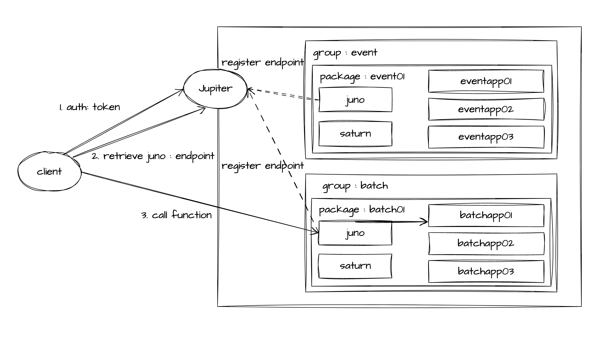
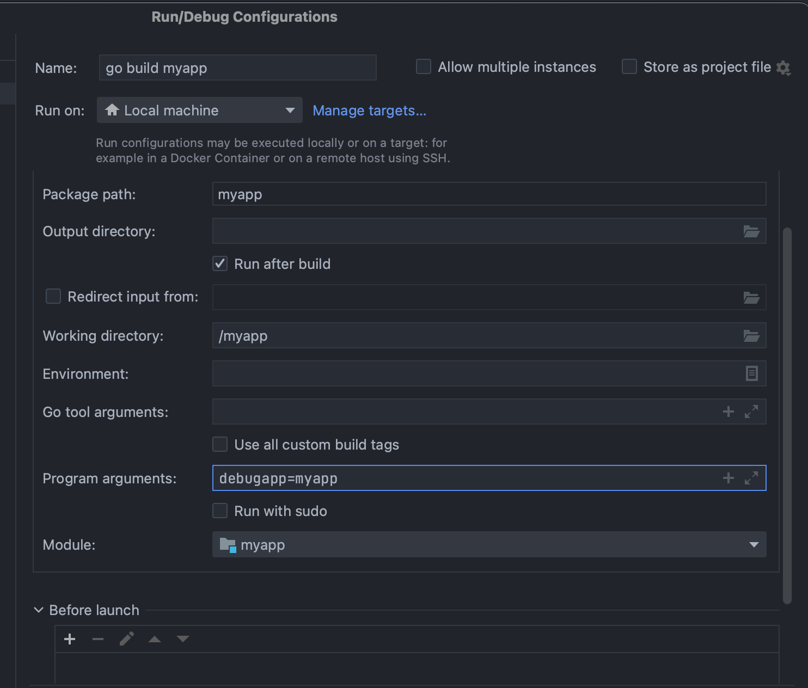

# fatima 운영환경 layout

# OPM 프로세스 그룹

Fatima 패키지 프로세스들은 편의상 그룹을 지정할 수 있습니다. 그 중 `OPM(Operation and Management)` 그룹은 Fatima 패키지 관리에 대한 작업을 수행합니다.

## jupiter

`jupiter`는 Fatima 패키지에 접근할 때 인증 게이트웨이 역할을 합니다. 이를 위해 `rocontext`를 사용하여 설정된 인증 정보를 활용합니다.

## juno

`juno`는 Fatima 패키지의 실제 관리 작업을 수행합니다. 

 - 프로세스 추가
 - 프로세스 중지
 - 패키지 상태 리포트
 - 프로세스 로그 레벨 관리

이외에도 다양한 작업을 수행할 수 있습니다. 

예를 들어, 프로세스가 종료되면 `Slack`으로 프로세스 다운 알림 메시지를 전송하고 자동으로 재시작해주는 기능을 제공할 수 있습니다.

## saturn

`saturn`은 내부에서 발생하는 모든 메시지를 처리합니다. 

예를 들어, 상태 메시지를 수신하여 프로세스 중단이 발생한 경우 `Slack`을 통해 알림을 전송할 수도 있습니다.

## deploy topology example



# fatima 패키지 좀 더 살펴보기

## 1. 패키지 기본 구조

### 1.1 패키지 폴더 구조

`${FATIMA_HOME}` 하위 디렉토리의 역할은 다음과 같습니다.

| 디렉토리 | 설명                                | 예제                                                                         |
| -------- | ----------------------------------- |----------------------------------------------------------------------------|
| app      | 사용자 프로세스 설치 폴더             | app/myapp                                                                  |
| bin      | Fatima 명령어                       | startro, stopro, ...                                                       |
| conf     | Fatima 환경 설정 파일들             | fatima-package-predefine.properties, fatima-package.yaml, logback.xml (미사용) |
| data     | 각 프로세스별 data 폴더              | data/myapp                                                                 |
| lib      | 공용 lib                             | 공용 shared lib 용도로 사용합니다.                                                   |
| log      | 프로세스 로깅 폴더                   | log/myapp                                                                  |
| package  | Fatima 패키지 상태                   | AS, PS, 로그레벨...                                                            |

### 1.2 프로세스 설치 폴더

모든 Fatima 프로세스는 `$FATIMA_HOME/app` 폴더 하위에 설치됩니다.

내가 설치한 프로그램 이름이 `myapp` 이라면 `$FATIMA_HOME/app/myapp` 폴더가 존재하고, 그 하위에는 `proc` 폴더가 존재합니다.

`proc` 폴더의 설명은 아래와 같습니다.

| 파일(디렉토리) | 설명                                                                                   | 예제                                                                         |
|----------|--------------------------------------------------------------------------------------|----------------------------------------------------------------------------|
| myapp.pid.output      | 이 폴더에는 실행된 프로세스의 `stdout`와 `stderr` 출력이 저장됩니다. 이를 통해 프로세스가 실행 중에 발생한 문제를 디버깅할 수 있습니다. | juno.24151.output                                                                 |
| myapp.pid      | 실행된 프로세스의 `pid`를 관리합니다.                                                              |                                                 |
| monitor     | 이 폴더에는 `myapp.pid.monitor`와 같은 형식의 파일이 출력됩니다. `monitor` 파일은 5초마다 프로세스의 메모리 상태 스냅샷을 기록하며, 최대 30M까지 파일을 저장합니다. 파일 크기가 30M를 넘어가면 파일이 롤링(덮어쓰기)됩니다.| juno.24151.monitor |

### 1.3 패키지 설정 폴더

`${FATIMA_HOME}/conf` 디렉토리에는 아래와 같은 2개의 파일이 존재합니다.

- `fatima-package-predefine.properties` : fatima-package-predefine 설정은 Fatima 패키지에 대한 설정을 정의합니다.
- `fatima-package.yml` : Fatima-package.yml 파일은 현재 구성된 **Fatima 패키지의 프로세스 내용**을 담고 있습니다. 이 파일은 사용자가 직접 수정할 일은 거의 없습니다. 대부분 Fatima 에서 제공하는 도구 명령어를 통해 설정을 변경하게 됩니다.

**fatima-package-predefine.properties**

``` yaml
# this is fatima package predefine configuration file
#
 
#var.global.package.groupname=mygroup
#var.global.package.hostname=myhost
#var.global.package.name=default
 
var.host.ipaddress=${var.builtin.local.ipaddress}
```

| 변수명             | 설명                                                                               | 예제                                                             |
|-----------------|----------------------------------------------------------------------------------|----------------------------------------------------------------|
| var.global.package.groupname | 패키지의 그룹 명칭을 의미합니다. 기본은 `basic` 값을 사용합니다.                                         |                                                                |
| var.global.package.hostname       | 패키지의 호스트명을 의미합니다. 기본은 `hostname` 값을 사용합니다.                                       |                                                                |
| var.global.package.name         | 패키지 명칭을 의미합니다. 기본은 `default`값을 사용합니다.                                            | 한 서버에서도 여러개의 계정으로 여러개의 패키지를 띄울 수도 있습니다. 이럴 때는 패키지의 이름으로 구분짓습니다. |
| var.host.ipaddress        | 이 서버의 ip 주소를 의미합니다. `${var.builtin.local.ipaddress}`으로 지정하면 기본적인 서버의 ip 주소를 사용합니다. | 서버의 ip가 여러개일 경우 내가 원하는 서버 ip를 지정할 수 있습니다.                      |


**fatima-package.yml**

``` yaml
# this is fatima-package.yaml sample
# group (define column)
# process list (define column)
#  gid, name, path, qclear, qkey, hb
# non-fatima process
# startmode : 0(always started by juno), 1(not started by juno), 2(by HA), 3(by PS)
group: [{id: 1, name: OPM}]
process:
- gid: 1
  name: jupiter
  loglevel: info
- gid: 1
  name: juno
  loglevel: info
- gid: 1
  name: saturn
  loglevel: info
```

## 2. 프로세스 분석

### 2.1 IDL debug 모드

실행 시, 커맨드 라인 입력으로 `-debugapp=MyAppName`과 같이 지정합니다.

GoLand 테스트 시에는 `debugapp=MyAppName`과 같이 `Program arguments`로 지정해 줍니다.

**Program arguments**



이후 `${FATIMA_HOME}/log/myapp` 디렉토리 로그 정보와 같이, 디버깅 할 수 있습니다.